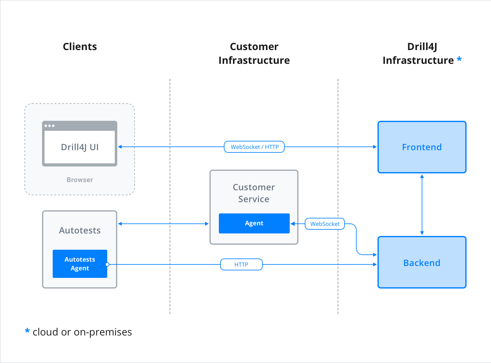
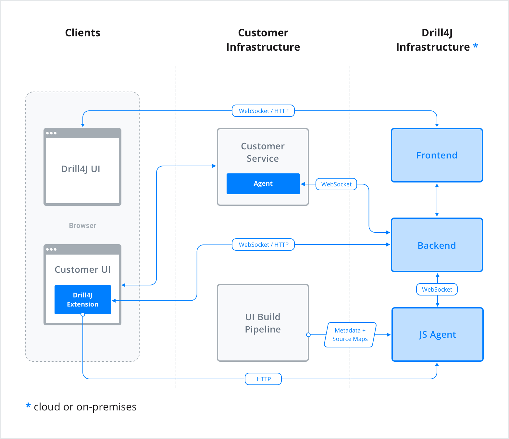

import ExternalLinkIcon from '/static/img/external-link.svg';

**Does Drill work only with JVM?**  
Currently yes, but we're working on .Net agent and JavaScript agent. Python and Ruby agents are also possible in the future.

**Which Java versions do you support?**  
Java 8+

**Can I use Microservice applications?**  
Yes, we're supporting microservice applications. [(more info)](installation/microservices)
 
**Can I use Drill for Android applications?**  
Yes, it is possible, but it's necessary to implement an agent for android application.

**Can I use .war?**  
Yes, but only monolith applications on Tomcat, Jetty, WildFly. Java 8+
 
**What method of collecting coverage are you using?**  
Probes in bytecode. So, methods can be covered in the range of 0.1 - 100. 
Also, we will add the ability to choose a method of coverage collecting. (By string and etc.)
 
**Which test types do you support?**  
-Manual [(use browser extension)](installation/extension)  
-Auto (API, UI) [(more info)](installation/autotest-agent)
 
**Why do I need it?**  
Probably, if your project is small and doesn't have a lot of tests, then you don't need it. BUT, if it's a legacy project with a lot of tests, the tool saves your testing time via Test gap analysis and minimizing of regression suite.

**How can I specify a backend host for a frontend container?**  
You need to set the **UPSTREAM** env variable for a frontend container.  
By default, **UPSTREAM** value is **drill-admin:8090**  

**Will information in the DB be saved, if I recreate backend container?**  
Yes, but you need to move the **/work** directory to the volume

**Where can I find API requests?**  
Swagger is available on port **8090** of backend service. For example, if  Drill frontend and backend parts are installed locally, then swagger is available at [http://localhost:8090](http://localhost:8090)
Also, you can download the [Postman collection](/assets/files/stable/drill-postman-collection.zip) with sample requests.

**My application has https connection. Does it suitable case for Drill?**   
Yes, Drill supports https connection. [(https drill setup)](/https-drill-setup) 

### Useful Links

[GitHub](https://github.com/Drill4J)

[Contribute](https://contribute.epam.com/products/136)

### Auto Testing Scheme

### Manual Testing Scheme

## Development Installation
### Frontend
See [https://github.com/Drill4J/admin-ui/tree/develop/dev-guide](https://github.com/Drill4J/admin-ui/tree/develop/dev-guide)

### Backend
See [https://github.com/Drill4J/Drill4J/blob/develop/README.md](https://github.com/Drill4J/Drill4J/blob/develop/README.md)

